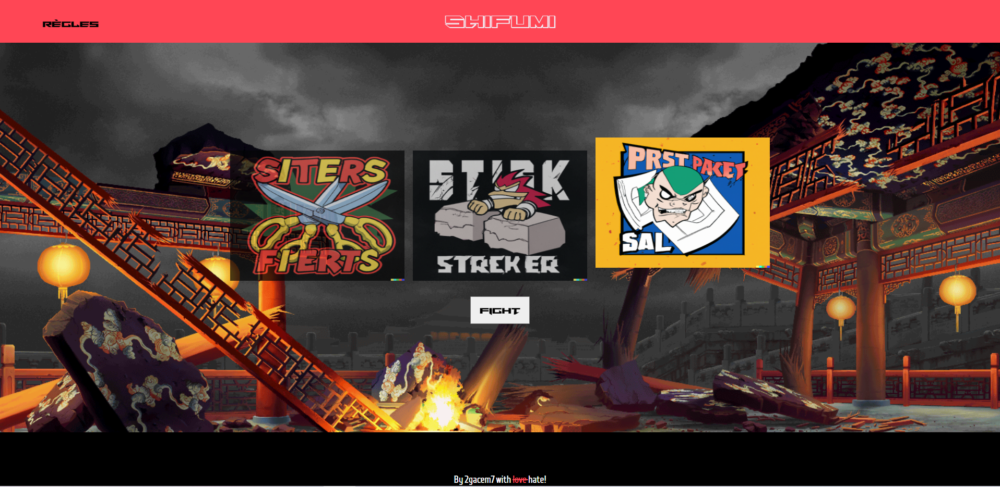
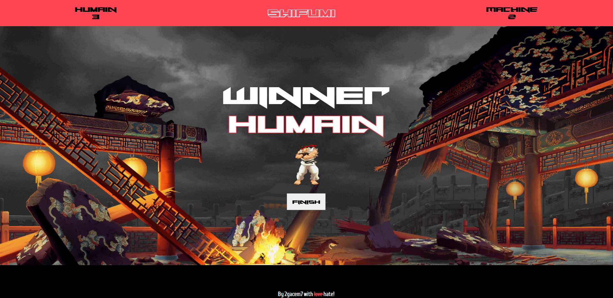

# Shifumi

A Shifumi (Rock-Paper-Scissors) game built with ReactJs.

## Getting Started

Play the Shifumi game on various devices, as it is now fully responsive and adaptable to different screen sizes.

### Playing Online

You can play the game online at: [https://2gacem7.github.io/Shifumi/](https://2gacem7.github.io/Shifumi/)

### Installing

Enter in the ./project folder.

Installation

    npm install

Start the project

    npm run start

## Screenshots and GIFs
### Desktop Screens

Mobile Screens

    
    
    

## Author
Gacem Ben Ayad
