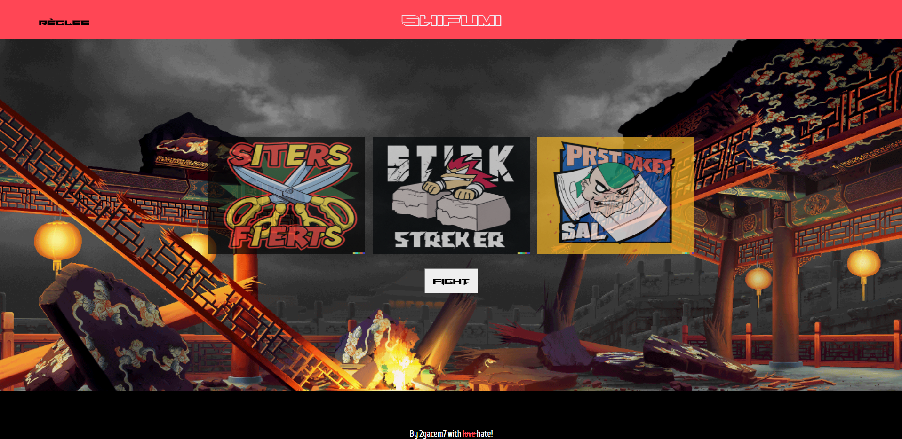

# Shifumi

A shifumi game with ReactJs.

## Getting Started

These instructions will give you a copy of the project up and running on
your local machine for testing purposes (and of course playing !). 

It's not reponsive, the ideal resolution to play is in desktop screen between 1200 x 800 and 1500 x 900. 

### Installing

A step by step series of examples that tell you how to get a development
environment running

Installation

    npm install

Start the project

    npm run start

## Authors

  - **Gacem Ben Ayad**
    

